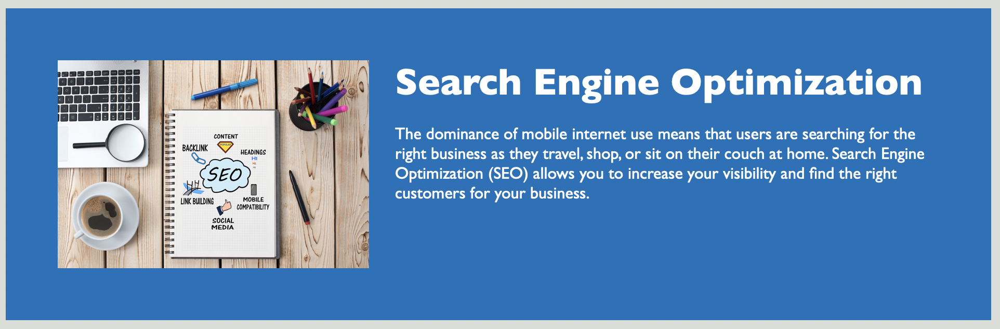

# Horiseon-marketing

## Description
- My motivation for this project was to build on my skillset as a student by learning how to optimise the accessibility of a webpage.
- The objective of this job was to ensure that the Horiseon webpage was accessible to people with disabilities and to maximise SEO capabilities as a result.
- The Horiseon webpage now has updates that add accessible alt attributes to all images and icons on the page. All HTML elements are now semantic. All links within the page now all function correctly. 
- This project taught me to think of all potential users of a webpage and to factor that into the building process. I also learned how crucial this is for enhancing SEO capabilities. 

## Usage
To use this webpage, you can use the headings in the top header bar to navigate to the relative information within the webpage.
You can do this by clicking on one of the headings and you will be taken to the correlating information on the page. 
See images below; the first image points to one of the headings, and the second image shows where you would be navigated to within the page. 

## [Link](https://j0shuaj0nes.github.io/Horizon-marketing/) to deployed webpage 
 

